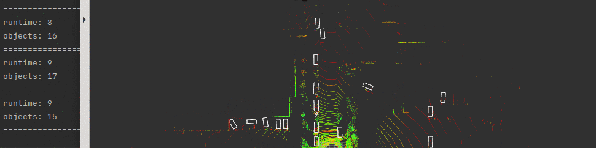

# Introduction

In this repo, we provide a ros wrapper for 3D object detection with TensorRT inference backend for real-time robotic applications. 
it is effective and efficient, achieving **10 ms** runtime and **85%** 3D Car mAP@R40.
1. we chose IA-SSD as baseline since its high efficiency and adopt **HAVSampler** to gain 1000x faster than **FPS** in sampling steps.
2. we implement **TensorRT plugins** for NMS postprocessing and some common-to-use operator of point-based point cloud detector, i.e, sampling, grouping, gather.
3. we export the onnx model for our pytorch detector and then build the TensorRT engine of this onnx model.

# Build
we test on the platform:

1. ubuntu18.0 with GPU 2080Ti
2. python3.7
3. pytorch1.12
4. cuda11.0
5. cudnn8.4
6. tensorrt8.4.0

You should follow the official guidance to install the above dependencies at first, and then build this package.
```shell
export CUDNN_DIR=/path/to/cudnn/root
export TENSORRT_DIR=/path/to/tensorrt/root

mkdir -p build && cd build
cmake .. -DCMAKE_BUILD_TYPE=Release -DTRT_QUANTIZE=FP16 -DCMAKE_CUDA_COMPILER=/usr/local/cuda/bin/nvcc
make -j$(nproc)
```
or build as normal ros package.

# Test
We test exported FP32 model with TensorRT in KITTI _val_ set and report the results as following:

|           |Car|Pedestrian|Cyclist|
|-----------|:---:|:----:|:------:|
| 3D AP@R11 |83.8752|53.9177|67.2500|    
| 3D AP@R40 |84.9749|53.1046|67.1609|       

# How to use
It receives msgs from sensor_msgs::PointCloud2 `/points` and publishes visualization_msgs::MarkerArray `/objects`. 
```shell
./devel/lib/point_detection/point_detector
```
we offer another utils script to publish point clouds from `.bin` files.
```shell
python src/pcvt.py -s bin -d topic -t /points -p /home/nrsl/Downloads/velodyne_points/data 
```