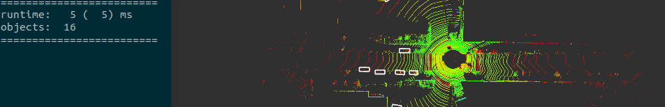

# Introduction

In this repo, we provide a ros wrapper for lightweight yet powerful 3D object detection with TensorRT inference backend for real-time robotic applications. 
1. It is effective and efficient, achieving **5 ms** runtime and **85%** 3D Car mAP@R40.
2. we chose **IA-SSD** as baseline since its high efficiency and adopt **HAVSampler** to gain 1000x faster than **FPS** in sampling steps.
3. we implement **TensorRT plugins** for NMS postprocessing and some common-to-use operator of point-based point cloud detector, e.g., sampling, grouping, gather.

# News
1. \[2022/04/14\]: This repository implements [GridBallQuery](doc/gridballquery.md) with a computational complexity of $\mathcal{O}(NK^3)$, instead of $\mathcal{O}(NM)$ of BallQuery. 
1. \[2022/04/08\]: Support INT8 quantization and [Profiler](doc/profile.md).
# Build
we test on the platform:

1. ubuntu18.0 with GPU 2080Ti
2. python3.7
3. pytorch1.12
4. cuda11.0
5. cudnn8.4
6. tensorrt8.4.0

You should follow the official guidance to install the above dependencies at first, and then build this package.
```shell
export CUDNN_DIR=/path/to/cudnn/root
export TENSORRT_DIR=/path/to/tensorrt/root

mkdir -p build && cd build
cmake .. -DCMAKE_BUILD_TYPE=Release -DTRT_QUANTIZE=FP16 -DCMAKE_CUDA_COMPILER=/usr/local/cuda/bin/nvcc
make -j$(nproc)
```
or build as normal ros package.

# Test
We test exported model with TensorRT in KITTI _val_ set and report the results **AP_3D@R11/R40** as following:
## iassd_hvcsx2_4x8_80e_kitti_3cls

|      |        Car        |    Pedestrian     |       Cyclist        | Runtime |
|:----:|:-----------------:|:-----------------:|:--------------------:|--------:|
| FP32 | 83.8752 / 84.9749 | 53.9177 / 53.1046 |  67.2500 / 67.1609   |   10 ms |
| FP16 | 80.2896 / 80.8535 | 53.0247 / 51.4732 |  67.8503 / 68.3627   |    8 ms |
| INT8 | 77.7286 / 79.3178 | 52.2956 / 50.7517 |  68.3595 / 68.3880   |    9 ms |

Unexpectedly, the runtime in INT8 mode is higher than that in FP16.
This may be due to the fact that we did not implement INT8 format for the custom layer and the point cloud model has less large block computation.

we also profile the model in different precisions, read [this](doc/profile.md) for details.
## iassd_hvcsx2_gq_4x8_80e_kitti_3cls

|      | Car | Pedestrian | Cyclist | Runtime |
|:----:|:---:|:----------:|:-------:|--------:|
| FP32 |     |            |         |    6 ms |
| FP16 |     |            |         |    5 ms |
| INT8 |     |            |         |         |


# How to use
It receives msgs from sensor_msgs::PointCloud2 `/points` and publishes visualization_msgs::MarkerArray `/objects`. 
```shell
./devel/lib/point_detection/point_detector
```
we offer another utils script to publish point clouds from `.bin` files.
```shell
python src/pcvt.py -s bin -d topic -t /points -p /home/nrsl/Downloads/velodyne_points/data 
```

# Limitation
1. ~~When build engine with INT8 mode, it throws `cuda configuration error` during calibration. Therefore, only FP32 and FP16 mode can be used.~~ 

# Others
Feel free to contact us if the source codes of pytorch models are required.

# TODO
1. consider use cuda graph to reduce the latency introduced by launching too much kernel.
2. use dynamic parallelism to avoid cpu-based loop in HAVSampling.