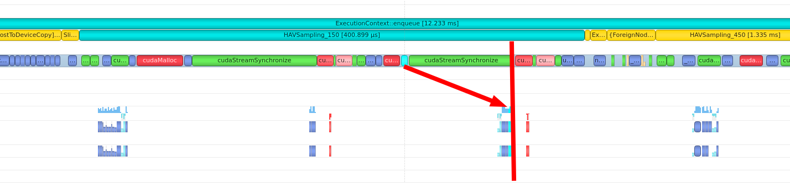

# TensorRT profile with Python API
```python
context.profiler = MyProfiler(["HAVSampling", "BallQuery", "ForeignNode", "NMSBEV"])
with engine.create_execution_context() as context:
    # ...
    for i in range(1000):
        infer()
    context.report_to_profiler()
    context.profiler.print()
```
For more information about how to use TensorRT's built-in profiler, please refer to this [doc](https://docs.nvidia.com/deeplearning/tensorrt/archives/tensorrt-843/developer-guide/index.html#profiling).

##  FP32
We profile the FP32 model and report the results as shown in following table, 
where ForeignNode means a large computation block that fuses many layers.
1. With our HAVSampling, sampler only takes up 5.7% of runtime. 
2. Besides, our batched NMS3D plugin also consumes less runtime than cpu version of postprocessing steps in  `pointpillar-int8` repository. 
3. There is still room for reducing latency, since BallQuery takes upto 49% runtime.


|        name | layers | average (ms) | median (ms) | percentage (%) |
|------------:|-------:|-------------:|------------:|---------------:|
| HAVSampling |      2 |        0.755 |       0.611 |            5.7 |
|   BallQuery |      8 |        5.448 |       5.311 |           49.1 |
| ForeignNode |      8 |        4.461 |       4.342 |           40.2 |
|      NMSBEV |      1 |        0.174 |       0.172 |            1.6 |
|      Others |     46 |        0.314 |       0.292 |            2.7 |
|       Total |     65 |         11.2 |        10.8 |          100.0 |

note: the runtime reported above are higher than that in `README.md` since profile will increase burden. 
But the runtime percentage of each module still meaningful. 

## FP16 
We also report the profile results of the FP16 model. 
1. The number of ForeignNode are increased, due to some layers in ForeignNode are not support half format. 
The reformatting node will be inserted in the front and end of this unsupported layer to reformat and fallback. 
2. As expected, quantization benefits computationally intensive layers, i.e., ForeignNode.

|        name | layers | average (ms) | median (ms) | percentage (%) |
|------------:|-------:|-------------:|------------:|---------------:|
| HAVSampling |      2 |        0.531 |       0.437 |            5.0 |
|   BallQuery |      8 |        5.325 |       5.058 |           57.4 |
| ForeignNode |     18 |        2.913 |       2.768 |           31.4 |
|      NMSBEV |      1 |        0.113 |       0.111 |            1.3 |
|      Others |     47 |        0.280 |       0.250 |            2.8 |
|       Total |     76 |          9.2 |         8.8 |          100.0 |

# INT8
we profile the int8 model and get results as followed.
1. INT8 quantization greatly reduces the runtime of MLPs, but introduces more reformatting nodes (in Others).

|        name | layers | average (ms) | median (ms) | percentage (%) |
|------------:|-------:|-------------:|------------:|---------------:|
| HAVSampling |      2 |        0.817 |       0.584 |            5.5 |
|   BallQuery |      8 |        5.493 |       5.394 |           50.6 |
| ForeignNode |      8 |        1.468 |       1.352 |           12.7 |
|      NMSBEV |      1 |        0.111 |       0.110 |            1.0 |
|      Others |    193 |        3.036 |       2.983 |           28.0 |
|       Total |    212 |         10.9 |        10.7 |          100.0 |


## conclusion
we find that:
1. ONNX graph with 200+ nodes can be converted to a TensorRT engine (plan) with 60 nodes, 
since many layers are fused as a large computation block.
2. The BallQuery takes up half of the runtime and is the efficiency bottleneck. 
3. INT8 quantization is not suitable for point-based detector consisting of many small operations.

# GridBallQuery
Currently, MLPs consume most of the time. Further, we can introduce [DBQ-SSD](http://arxiv.org/abs/2207.10909) to reduce the number of points passing through MLPs.

|        name | layers | average (ms) | median (ms) | percentage (%) |
|------------:|-------:|-------------:|------------:|---------------:|
| HAVSampling |      2 |        1.159 |       0.972 |           15.0 |
|   BallQuery |      8 |        0.643 |       0.635 |            9.8 |
| ForeignNode |      8 |        4.415 |       4.326 |           66.9 |
|      NMSBEV |      1 |        0.131 |       0.129 |            2.0 |
|      Others |     46 |        0.286 |       0.266 |            4.1 |
|       Total |     65 |          6.6 |         6.5 |          100.0 |


# profile HAVSampling with NSight System
In HAVSampling, CPU invoked kernel functions serval times to optimize the best suitable voxel size in a do-while block.
For each iteration, it is needed to wait for the results of the latest kernel function and copy the results to CPU. 
Then CPU device to break the loop or not by this result. 
Hence, the synchronization is implicit needed as shown in the following figure, which greatly reduce the throughput.
